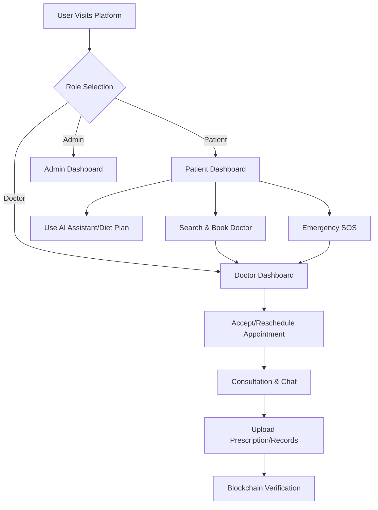

## 1. Product Overview
MediCare+ is a smart digital healthcare management platform for Patients, Doctors, and Admin/Hospital Staff.
- It provides authentication, role-based dashboards, appointment booking, medical records management, AI health assistance, diet recommendations, lab report analysis, and blockchain verification.
- Target value: A startup-level, premium healthcare platform for streamlined medical processes and enhanced patient-doctor communication.

## 2. Core Features

### 2.1 User Roles
| Role | Registration Method | Core Permissions |
|------|---------------------|------------------|
| Patient | Email & Password | Book appointments, view records, chat with doctor, use AI assistant, SOS |
| Doctor | Login/Signup (Admin approval) | Manage appointments, view patient records, add diagnosis/prescriptions |
| Admin | Pre-configured Admin Login | Manage users/doctors, monitor system, verify records, view logs |

### 2.2 Feature Module
1. **Authentication**: Login, Registration, Role selection
2. **Dashboards**: Patient, Doctor, and Admin dashboards with role-specific widgets
3. **Appointment System**: Search doctors, book/reschedule slots, manage queues
4. **Medical Records**: Upload lab reports, view history, blockchain verification badge
5. **AI Assistant & Diet**: AI chat, OCR lab report extraction, personalized diet plans
6. **Communication**: Real-time chat, emergency SOS

### 2.3 Page Details
| Page Name | Module Name | Feature description |
|-----------|-------------|---------------------|
| Landing Page | Hero section | Splash, features overview, login/register CTA |
| Auth Pages | Login/Register | Form validation, role selection, forgot password |
| Patient Dashboard | Overview Widgets | Upcoming appointments, health summary, quick actions |
| Doctor Dashboard | Overview Widgets | Today's appointments, pending requests, emergency queue |
| Admin Dashboard | Overview Widgets | System analytics, user/doctor management, verification logs |
| Appointments | Booking/Management | Calendar view, slot selection, status updates |
| Medical Records | Record List & Upload | File preview, blockchain badge, OCR extraction for lab reports |
| AI Health Assistant | Chat Interface | Symptom checker, wellness advice, diet recommendations |
| Messages | Chat System | Real-time messaging between doctor and patient |

## 3. Core Process
The main user flow involves registration, booking an appointment, conducting the consultation (with chat and records), and post-consultation management (prescriptions, AI diet).

## 4. User Interface Design
### 4.1 Design Style
- Primary Colors: Healthcare Blue (#0ea5e9), Clean White (#ffffff), Success Green (#22c55e)
- Button style: Soft rounded corners, subtle shadows, premium glassmorphism where applicable
- Font and sizes: Modern clean typography (e.g., Inter/Roboto), hierarchical scaling
- Layout style: Card-based, sidebar navigation for dashboards, clean spacious layout
- Icon/emoji style suggestions: Professional line icons (Lucide-react)

### 4.2 Page Design Overview
| Page Name | Module Name | UI Elements |
|-----------|-------------|-------------|
| Patient Dashboard | Main Layout | Greeting, Stat cards (appointments, reports), Action buttons |
| Medical Records | Record Grid | Filterable cards, verification badges, file thumbnail previews |
| AI Assistant | Chat View | Message bubbles, typing indicators, input area with attachment |
| Appointments | Calendar/List | Interactive calendar, status pills (Pending, Confirmed, Emergency) |

### 4.3 Responsiveness
Desktop-first approach with full mobile-adaptive layouts, optimized touch targets for mobile users, and responsive grids for dashboards.
