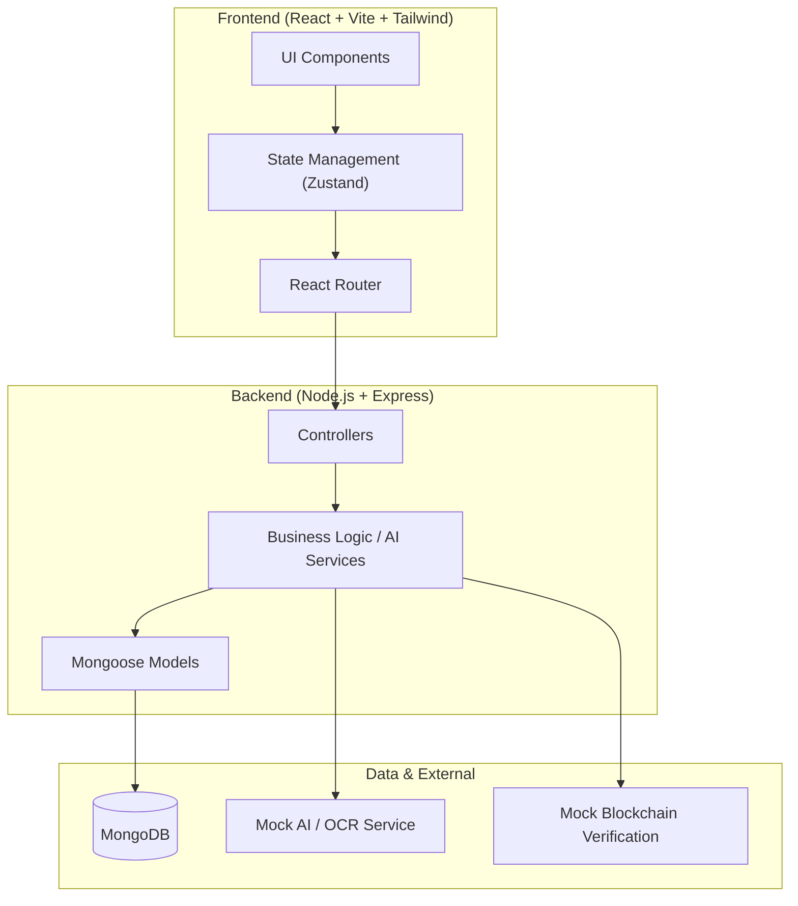
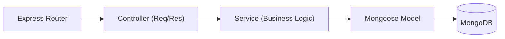
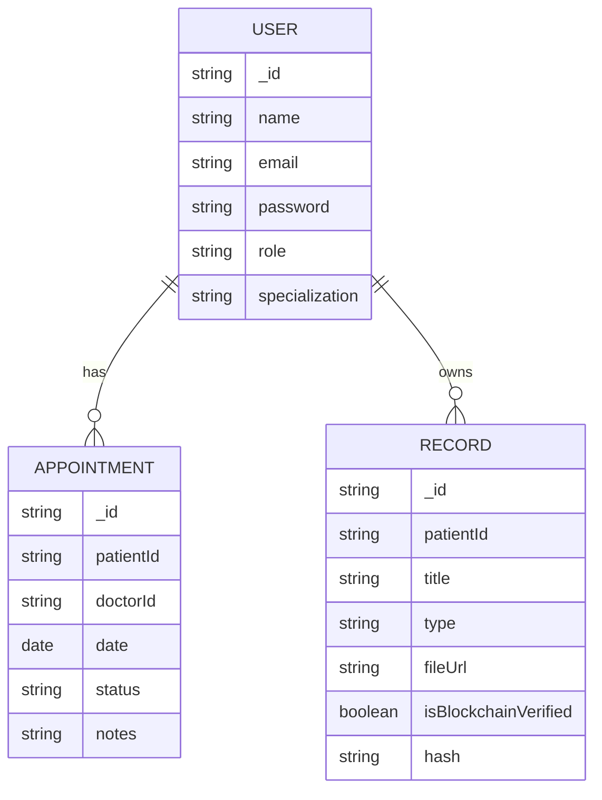

## 1. Architecture Design


## 2. Technology Description
- Frontend: React@18 + tailwindcss@3 + vite + zustand + react-router-dom + lucide-react
- Backend: Node.js + Express.js + Mongoose + JWT
- Initialization Tool: vite-init (react-express-ts template)

## 3. Route Definitions
| Route | Purpose |
|-------|---------|
| `/` | Landing/Splash page |
| `/login` | User authentication |
| `/register` | New user registration |
| `/patient/dashboard` | Patient home dashboard |
| `/patient/appointments` | Book and view appointments |
| `/patient/records` | Medical records and uploads |
| `/patient/ai-assistant` | AI chat and diet recommendations |
| `/doctor/dashboard` | Doctor home dashboard |
| `/doctor/appointments` | Manage patient appointments |
| `/admin/dashboard` | Admin analytics and user management |

## 4. API Definitions
```typescript
// Authentication
POST /api/auth/register (body: { email, password, role, name })
POST /api/auth/login (body: { email, password }) -> { token, user }

// Appointments
GET /api/appointments
POST /api/appointments (body: { doctorId, date, time, reason })
PUT /api/appointments/:id/status (body: { status })

// Medical Records
GET /api/records
POST /api/records (body: { title, type, fileUrl })
POST /api/records/analyze (body: { fileUrl }) -> { extractedData, summary }

// Chat & AI
POST /api/ai/chat (body: { message, history })
POST /api/ai/diet (body: { age, weight, height, conditions })
```

## 5. Server Architecture Diagram


## 6. Data Model
### 6.1 Data Model Definition

